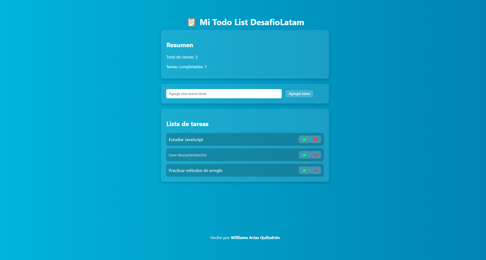

# 📋 Todo List JS

Una aplicación web desarrollada en JavaScript puro que permite gestionar tareas pendientes con opciones para agregar, marcar como completadas y eliminar tareas.

---

## 🚀 Demo en vivo

🌐 [Ver página en GitHub Pages](https://wiimri.github.io/todolistjs/)

---

## 🧹 Características

- ✅ Agregar tareas.
- 🗑️ Eliminar tareas individualmente.
- ✍️ Marcar tareas como completadas (con efecto visual).
- 📊 Contadores dinámicos de tareas totales y realizadas.
- 🎨 Estilo visual atractivo con fondo en gradiente y diseño moderno.

---

## 🗈️ Vista previa



---

## 📁 Estructura del proyecto

```
todolistjs/
├── index.html
├── assets/
│   ├── css/
│   │   └── style.css
│   └── js/
│       └── app.js
```

---

## ⚙️ Tecnologías usadas

- HTML5
- CSS3
- JavaScript

---

## 👨‍💻 Autor

Desarrollado por **Williams Arias Quilodrán**  
🔗 [github.com/wiimri](https://github.com/wiimri)
